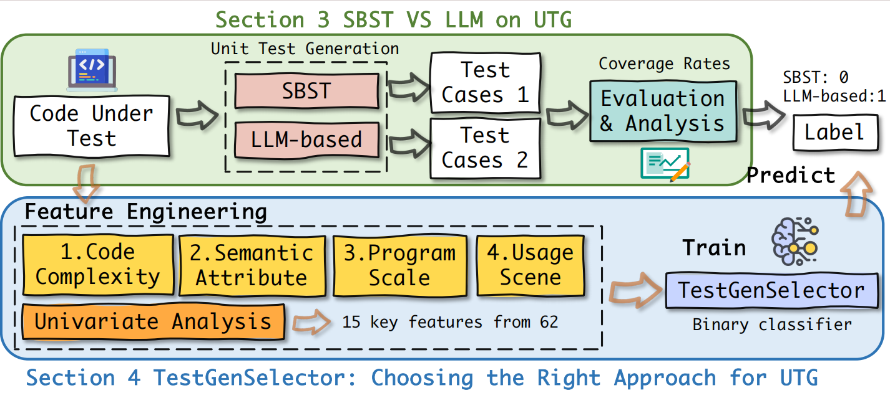

# No More Guess Work

> *Empowering intelligent test generation through interpretable static analysis and actionable metrics.*

<p align="center">
  
</p>
<p align="center">
  <em>Figure: Empirical Study and TestGenSelector Pipeline</em>
</p>

[](https://www.python.org/)

---

## 🚀 Motivation & Overview

Driven by empirical research and developer intuition, **Nomoreguesswork** aims to bring clarity and intelligence to the process of automated test generation tool selection. By conducting a thorough static analysis of source code, we identify and organize 60 key features into four major categories:

- **Code Complexity**
- **Semantic Attributes**
- **Program Scale**
- **Usage Scenario**

These features capture the multifaceted nature of code and its suitability for different test generation approaches.

We introduce **TestGenSelector**, a lightweight, interpretable classifier that leverages these features to predict the most suitable test generation tool for a given codebase. Unlike black-box deep learning models, TestGenSelector offers transparency and actionable insights, achieving around **80% classification precision** and improving UTG coverage by **5%–18%** over baseline methods.

For a complete list and detailed explanation of all features, please refer to [All-feature.pdf](analysis/All-feature.pdf).

---

## 🧩 Key Features 

### <span style="color:#4F8A8B;">Code Complexity Metrics</span>

This section outlines key metrics used to evaluate code complexity, focusing on logical complexity, coupling, and theoretical complexity.

#### Logical Complexity Metrics

- **Maximum Cyclomatic Complexity (OCmax)**  
  OCmax measures the highest cyclomatic complexity among all non-abstract methods in a class. Each method starts with a base complexity of 1, increasing by 1 for each control flow structure (e.g., for loops, if statements, while loops, ternary operators, or switch case statements, excluding consecutive cases). This metric indicates the number of branches in the code, reflecting how difficult a method is to understand.

- **Average Operation Complexity (OCavg)**  
  OCavg is the average cyclomatic complexity across all non-abstract methods in a class. It provides an average measure of logical complexity for a class's methods.

- **Weighted Methods per Class (WMC)**  
  WMC is the sum of cyclomatic complexities of all methods in a class, calculated as:

  $$
  \text{WMC} = \sum (\text{cyclomatic complexity of each method})
  $$

  This metric captures the total logical complexity of a class’s method set.

- **Number of Dependencies (Dcy)**  
  Dcy counts the number of other classes a given class depends on, calculated using a dependency graph and graph traversal algorithms. High dependency counts indicate lower modularity.

- **Number of Transitive Dependencies (Dcy\*)**  
  Dcy* extends Dcy by including both direct and indirect dependencies, reflecting a class’s deeper coupling within the dependency network.

- **Number of Dependents (DPT)**  
  DPT measures the number of classes that directly depend on the current class, identified by searching for references to the class within the project.

- **Number of Transitive Dependents (DPT\*)**  
  DPT* counts classes that indirectly depend on the current class through dependency chains, calculated using graph traversal algorithms to identify transitive dependencies.

- **Cyclic Dependencies (Cyclic)**  
  Cyclic counts the number of classes involved in cyclic dependencies (direct or indirect) with the current class. It is calculated by constructing a dependency graph, identifying strongly connected components, and counting them (subtracting 1 for the class itself).

#### Theoretical Complexity Metrics

- **Level (Level)**  
  Level measures the number of dependency "layers" for a class. A class with no dependencies has a Level of 0. For classes with dependencies, it is calculated as:

  $$
  \text{Level} = \max(\text{Level of dependent classes}) + 1
  $$

  This excludes classes with mutual or cyclic dependencies.

- **Adjusted Level (Level\*)**  
  Level* builds on Level by accounting for cyclic dependencies. It is calculated as:

  $$
  \text{Level*} = \max(\text{Level* of non-cyclic dependencies}) + \text{number of cyclic dependencies}
  $$

- **Depth of Inheritance Tree (DIT)**  
  DIT measures the depth of a class’s inheritance hierarchy, counting the levels from the class to the root (e.g., java.lang.Object). Each parent class increments the depth by 1. Deep inheritance trees can increase design complexity.

---

### <span style="color:#4F8A8B;">Semantic Attributes</span>

These metrics focus on comments and documentation to assess code readability and quality.

- **Comment Lines of Code (CLOC)**  
  CLOC counts the total number of lines containing comments in a code file:

  $$
  \text{CLOC} = \left| \{ l \in L \mid l \text{ contains comment content} \} \right|
  $$

  where $L$ is the set of non-blank code lines. It reflects comment density and code interpretability.

- **Javadoc Method Coverage (JM)**  
  JM measures the percentage of methods with Javadoc comments:

  $$
  \text{JM} = \frac{|\text{methods with Javadoc comments}|}{|\text{total methods in the class}|} \times 100\%
  $$

- **Javadoc Field Coverage (JF)**  
  JF measures the percentage of fields with Javadoc comments:

  $$
  \text{JF} = \frac{|\text{fields with Javadoc comments}|}{|\text{total fields in the class}|} \times 100\%
  $$

---

### <span style="color:#4F8A8B;">Program Scale Metrics</span>

These metrics quantify the physical and logical size of code.

- **Lines of Code (LOC)**  
  LOC counts the total number of code lines in a class, including comments but excluding blank lines.

- **Non-Comment Lines of Code (NCLOC)**  
  NCLOC is LOC minus pure comment lines:

  $$
  \text{NCLOC} = \text{LOC} - \left| \{ l \in L \mid l \text{ is a pure comment line} \} \right|
  $$

  This reflects the scale of executable code.

- **Class Size Attributes (CSA)**  
  CSA counts non-static attributes in a class:

  $$
  \text{CSA} = \left| \{ f \in F \mid f \text{ is a non-static field defined in the class} \} \right|
  $$

- **Class Size Operations (CSO)**  
  CSO counts non-static methods in a class:

  $$
  \text{CSO} = \left| \{ m \in M \mid m \text{ is a non-static method defined in the class} \} \right|
  $$

- **Class Size (Operations + Attributes) (CSOA)**  
  CSOA is the sum of CSA and CSO, measuring the logical scale of a class.

- **Maximum Operation Size (OSmax)**  
  OSmax is the number of statements in the largest method in a class:

  $$
  \text{OSmax} = \max( \{ \text{number of statements in method } m \mid m \in M \} )
  $$

- **Number of Operations Overridden (NOOC)**  
  NOOC counts methods in a subclass that override parent class methods.

- **Number of Operations Inherited (NOIC)**  
  NOIC counts methods inherited by a class, excluding constructors, private, static, abstract, or locally defined methods.

---

### <span style="color:#4F8A8B;">Usage Scenarios</span>

These scenarios describe common code functionalities and responsibilities based on developer intuition and empirical studies.

- **String Processing**  
  Involves creating, manipulating, parsing, formatting, or converting strings, such as text processing, report generation, input sanitization, string splitting, concatenation, or regular expression matching.

- **File Operations**  
  Covers interactions with the file system, including file creation, reading, and path management (e.g., reading configuration files or exporting data to CSV).

- **Database Operations**  
  Handles database connections, queries, updates, or transaction management, such as executing SQL queries, using ORMs, or defining data models.

- **Mathematical Computation**  
  Focuses on numerical computations, algorithm implementations, or statistical analyses, including financial calculations, machine learning predictions, or geometric operations.

---


## 🏗️ Project Structure

```plaintext
Nomoreguesswork-main/
├── analysis/              # Data analysis scripts & visualizations
│   ├── correlation.py
│   ├── correlation_matrix.png
│   ├── pipe.png
│   └── All-feature.pdf
├── data/                  # Processed datasets
├── Invocation-API/        # API scripts for  invocation
├── model/                 # Machine learning models
├── testcase/              # Test case scripts & results
├── TestGenSelector/       # Test  selection logic
└── README.md
```

---

## 🛠️ Getting Started

1. **Clone the repository**
   ```bash
   git clone https://github.com/your-username/Nomoreguesswork.git
   cd Nomoreguesswork-main
   ```

2. **Run analysis**
   ```bash
   # Example: Run a data analysis script
   python analysis/Single-variable logistic-sym.py

   ```

---

## 📖 Usage

- **Data Analysis:** Explore the `analysis/` folder for scripts and visualizations.
- **Model Training:** Use scripts in `model/` to train or evaluate machine learning models.
- **API Calls:** Invoke models via the API scripts in `Invocation-API/`.
- **Testing:** Test cases in the `testcase/` directory.

---

## 📚 Documentation

- [All-feature.pdf](analysis/All-feature.pdf): Comprehensive feature documentation and analysis report.

---

## 🤝 Contributing

Contributions are welcome! Please open issues or submit pull requests for improvements, bug fixes, or new features.

---

> *From empirical insight to actionable intelligence—making test generation smarter, one feature at a time.*

---

If you need further customization or want to add more visual or interactive elements, feel free to provide additional resources or requirements!
